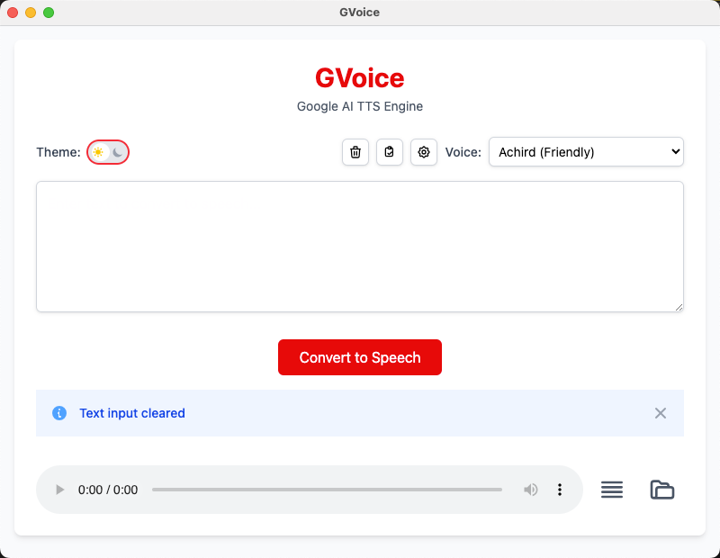
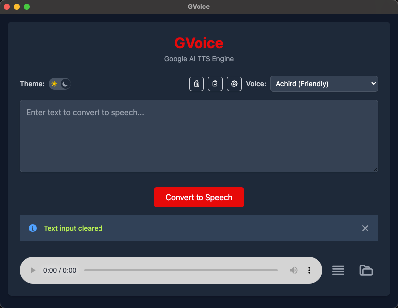
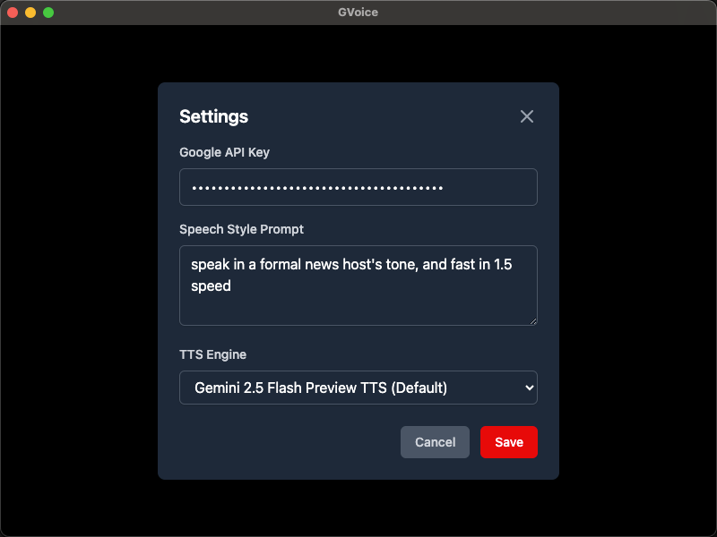
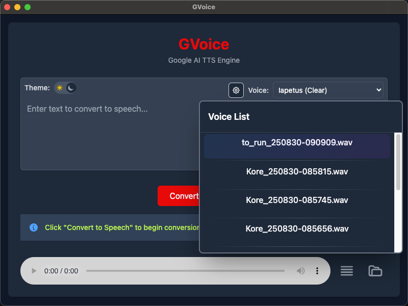

# GVoice

GVoice is a lightweight, desktop Text-to-Speech (TTS) application powered by Google AI's Gemini TTS API. Convert your text to natural-sounding speech effortlessly with support for multiple voices, dark/light themes, and customizable speech styles.

## Features

- **Google AI TTS Engine**: Leverages Google's Gemini 2.5 Flash and Pro models for high-quality voice synthesis
- **Multiple Voices**: Choose from 30+ pre-built voices with different personalities and tones
- **Dark/Light Mode**: Toggle between themes for comfortable usage in any environment
- **Customizable Speech Styles**: Add custom prompts to control the speaking style and tone
- **Audio File Management**: Automatically saves generated audio files and provides easy access
- **Voice List**: Browse and replay previously generated audio files
- **Settings Management**: Configure API keys, TTS engines, and preferences
- **Cross-Platform**: Built with Electron for Windows, macOS, and Linux
- **No Token Limits**: Direct API integration without subscription restrictions

## Screenshots

### Light Mode


### Dark Mode


### Settings


### Voice List


## Installation

### Prerequisites
- Node.js (v16 or higher)
- npm or yarn
- Google AI API Key (from [Google AI Studio](https://makersuite.google.com/app/apikey))

### Setup
1. Clone the repository:
   ```bash
   git clone https://github.com/activebook/GVoice.git
   cd GVoice
   ```

2. Install dependencies:
   ```bash
   npm install
   ```

3. Build the CSS:
   ```bash
   npm run build:css
   ```

4. Start the application:
   ```bash
   npm start
   ```

### Building for Production
- **macOS**: `npm run build:mac`
- **Windows**: `npm run build:win`
- **All platforms**: `npm run build`

## Usage

1. **First Time Setup**:
   - Launch GVoice
   - Click the settings icon (gear) in the top-right
   - Enter your Google AI API key
   - Optionally configure speech style and TTS engine
   - Click "Save"

2. **Convert Text to Speech**:
   - Enter your text in the input field
   - Select a voice from the dropdown
   - Click "Convert to Speech"
   - The audio will be generated and automatically played

3. **Manage Audio Files**:
   - Click the folder icon to open the audio files directory
   - Use the list icon to browse and play previous generations

4. **Theme Toggle**:
   - Use the theme switch in the top-left to toggle between light and dark modes

## Configuration

### Settings
- **Google API Key**: Required for TTS functionality
- **Speech Style Prompt**: Custom instructions for voice style (e.g., "Speak in a calm, professional tone")
- **TTS Engine**: Choose between Gemini 2.5 Flash (faster) or Pro (higher quality) models
- **Default Voice**: Set your preferred default voice

### Available Voices
- Zephyr (Bright)
- Puck (Upbeat)
- Charon (Informative)
- Kore (Firm) - Default
- Fenrir (Excitable)
- Leda (Youthful)
- Orus (Firm)
- Aoede (Breezy)
- Callirrhoe (Easy-going)
- Autonoe (Bright)
- Enceladus (Breathy)
- Iapetus (Clear)
- Umbriel (Easy-going)
- Algieba (Smooth)
- Despina (Smooth)
- Erinome (Clear)
- Algenib (Gravelly)
- Rasalgethi (Informative)
- Laomedeia (Upbeat)
- Achernar (Soft)
- Alnilam (Firm)
- Schedar (Even)
- Gacrux (Mature)
- Pulcherrima (Forward)
- Achird (Friendly)
- Zubenelgenubi (Casual)
- Vindemiatrix (Gentle)
- Sadachbia (Lively)
- Sadaltager (Knowledgeable)
- Sulafat (Warm)

## Development

### Project Structure
```
GVoice/
├── main.ts              # Electron main process
├── preload.ts           # Preload script for secure API exposure
├── src/
│   ├── index.html       # Main UI
│   ├── renderer.ts      # Frontend logic
│   └── styles.css       # Tailwind CSS styles
├── tts-service.ts       # TTS service handlers
├── tts-worker.ts        # Google AI TTS integration
├── config-reader.ts     # Configuration management
├── utils.ts             # Utility functions
├── config.yaml          # Voice and settings configuration
├── package.json         # Dependencies and scripts
└── assets/              # App icons and assets
```

## Directory Purposes:

- `./`, `src/` - TypeScript source files
- `lib/` - Compiled JavaScript (from TypeScript)
- `dist/` - Packaged application (from Electron Builder)
- `out/` - Published releases (from Electron Forge)


### Development Commands
- `npm run watch:css` - Watch CSS changes during development
- `npm run package` - Package the app for distribution
- `npm run make` - Create distributable packages

## API Integration

GVoice uses Google's Gemini AI models for TTS:
- **gemini-2.5-flash-preview-tts**: Faster generation, good quality
- **gemini-2.5-pro-preview-tts**: Higher quality, slightly slower

The app supports proxy configuration via environment variables:
- `HTTP_PROXY` or `HTTPS_PROXY`

## Author

**Charles Liu** - [activebook](https://github.com/activebook)
