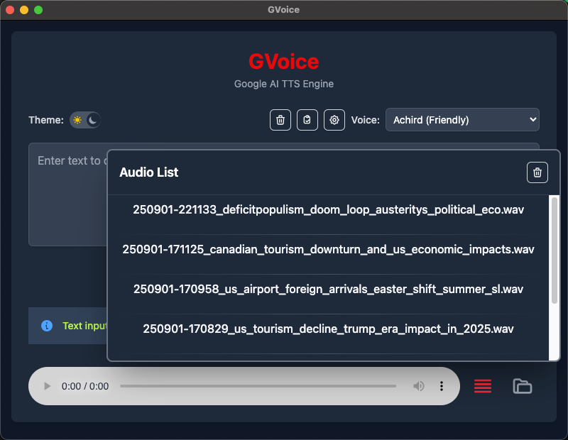

# GVoice

GVoice is a lightweight, desktop Text-to-Speech (TTS) application powered by Google AI's Gemini TTS API. Convert your text to natural-sounding speech effortlessly with support for multiple voices, dark/light themes, and customizable speech styles.

## Features

- **Google AI TTS Engine**: Leverages Google's Gemini 2.5 Flash and Pro models for high-quality voice synthesis
- **Multiple Voices**: Choose from 30+ pre-built voices with different personalities and tones
- **Dark/Light Mode**: Toggle between themes for comfortable usage in any environment
- **Customizable Speech Styles**: Add custom prompts to control the speaking style and tone
- **AI-Powered Filename Generation**: Automatically generates descriptive filenames using AI based on content
- **Audio File Management**: Automatically saves generated audio files and  replay on selection
- **Settings Management**: Configure API keys, TTS engines, and preferences with persistent storage
- **Clipboard Integration**: Paste text directly from clipboard for quick input
- **Proxy Support**: Automatic detection and configuration of system proxies (HTTP, HTTPS, SOCKS)
- **Clear Audio Files**: Bulk delete all generated audio files with confirmation
- **Default Voice Memory**: Remembers your preferred voice selection across sessions

## Screenshots

### Light Mode


### Dark Mode


### Settings


### Audio List


## Installation

### Prerequisites
- Node.js (v16 or higher)
- npm or yarn
- Google AI API Key (from [Google AI Studio](https://makersuite.google.com/app/apikey))

### Setup
1. Clone the repository:
   ```bash
   git clone https://github.com/activebook/GVoice.git
   cd GVoice
   ```

2. Install dependencies:
   ```bash
   npm install
   ```

3. Build the CSS:
   ```bash
   npm run build:css
   ```

4. Start the application:
   ```bash
   npm start
   ```

### Building for Production
- **macOS**: `npm run build:mac`
- **Windows**: `npm run build:win`
- **All platforms**: `npm run build`

## Usage

1. **First Time Setup**:
   - Launch GVoice
   - Click the settings icon (gear) in the top-right
   - Enter your Google AI API key
   - Optionally configure speech style and TTS engine
   - Click "Save"

2. **Convert Text to Speech**:
   - Enter your text in the input field
   - Select a voice from the dropdown
   - Click "Convert to Speech"
   - The audio will be generated and automatically played

3. **Manage Audio Files**:
   - Click the folder icon to open the audio files directory
   - Use the list icon to browse and play previous generations

4. **Theme Toggle**:
   - Use the theme switch in the top-left to toggle between light and dark modes

### Proxy Support
GVoice automatically detects and configures system proxy settings for:
- **HTTP Proxy**: Standard web proxy configuration
- **HTTPS Proxy**: Secure web proxy configuration
- **SOCKS Proxy**: SOCKS4/SOCKS5 proxy support

Proxy settings are detected from:
- Environment variables (`HTTP_PROXY`, `HTTPS_PROXY`)
- System proxy configuration (Windows Registry, macOS scutil, Linux gsettings)

## Filename Generation

GVoice features intelligent filename generation that automatically creates descriptive names for your audio files based on their content.

## Development

### Project Structure
```
GVoice/
├── main.ts              # Electron main process
├── preload.ts           # Preload script for secure API exposure
├── src/
│   ├── index.html       # Main UI
│   ├── renderer.ts      # Frontend logic
│   └── styles.css       # Tailwind CSS styles
├── tts-service.ts       # TTS service handlers
├── tts-worker.ts        # Google AI TTS integration
├── config-reader.ts     # Configuration management
├── utils.ts             # Utility functions
├── config.yaml          # Voice and settings configuration
├── package.json         # Dependencies and scripts
└── assets/              # App icons and assets
```

## Directory Purposes:

- `./`, `src/` - TypeScript source files
- `lib/` - Compiled JavaScript (from TypeScript)
- `dist/` - Packaged application (from Electron Builder)
- `out/` - Published releases (from Electron Forge)


### Development Commands
- `npm run watch:css` - Watch CSS changes during development
- `npm run package` - Package the app for distribution
- `npm run make` - Create distributable packages

### Release Process
GVoice includes an automated release system (`build/release.sh`)

Usage:
```bash
# Dry run (simulate release)
./build/release.sh --dryrun

# Build only
./build/release.sh --build

# Full release
./build/release.sh --release
```

## Author

**Charles Liu** - [activebook](https://github.com/activebook)
